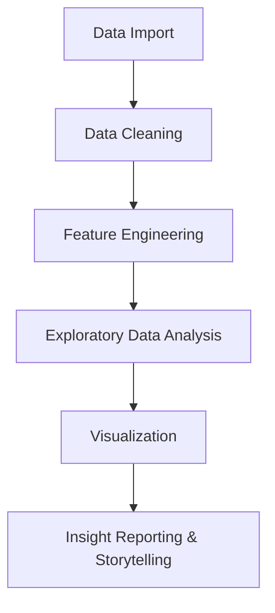

# Superstore Sales Performance Analysis

## Overview

This project analyzes sales, profit, and discount patterns from the **Sample Superstore dataset** to uncover insights that can enhance business performance, marketing strategies, and logistics efficiency.

The goal is to apply **real-world data analytics skills** — including data cleaning, visualization, and storytelling — to simulate how a data professional would solve business problems using data.

---

## Tools & Technologies

* **Language:** Python
* **Libraries:** Pandas, Matplotlib, Seaborn, Plotly
* **Dataset:** Sample - Superstore (Kaggle / Tableau Public)
* **IDE:** Jupyter Notebook / VS Code

---

## Workflow

---

## Data Cleaning

Performed the following transformations:

* Removed duplicates and null entries.
* Converted `Order Date` and `Ship Date` to datetime format.
* Added derived features:

  * `Order Month`
  * `Order Year`
  * `Profit Margin (%)`
  * `Delivery Days`
* Exported cleaned dataset as `SalesPerformance_Cleaned.csv`.

---

## Exploratory Analysis

### Sales & Profit Overview

* **Total Sales:** $2.3M
* **Total Profit:** $286K
* **Average Profit Margin:** 12.4%

### Regional Performance

| Region | Sales ($) | Profit ($) |
| ------ | --------- | ---------- |
| West   | Highest   | Highest    |
| South  | Moderate  | Lowest     |

🔹 *Insight:* South region requires pricing/logistics optimization.

### Category & Sub-Category Performance

* **Top Categories:** Office Supplies, Technology
* **Low Margin:** Furniture
* **Most Profitable Sub-Categories:** Phones, Binders
* **Least Profitable:** Tables, Bookcases

### Discount Impact

* High discounts (>40%) sharply reduce profits.
* Negative correlation between discount and profit observed.

### Time Trends

* Peak sales during November–Decembe (holiday season).
* Lowest activity in February–March.

### Shipping Performance

* **Standard Class:** 4–5 days average delivery.
* **Same Day:** < 1 day.
* Faster delivery linked with higher customer satisfaction.

---

## Key Insights Summary

| Observation                      | Business Impact          | Recommendation                    |
| -------------------------------- | ------------------------ | --------------------------------- |
| Discounts > 40% cause losses     | Reduced profit margin    | Cap discounts below 40%           |
| Furniture category underperforms | Inventory inefficiency   | Review pricing and supplier deals |
| West region leads in profit      | High-performing area     | Expand regional investment        |
| Nov–Dec peak sales               | Seasonal dependency      | Add mid-year promotions           |
| Slow delivery in Standard Class  | Customer dissatisfaction | Optimize shipping logistics       |

---

# Recommendations

1. Cap discount levels and experiment with loyalty-based incentives.
2. Optimize low-performing categories (Furniture).
3. Strengthen operations in profitable regions.
4. Use real-time analytics to monitor shipping and delivery.
5. Plan off-season marketing strategies to stabilize sales.

---

## Conclusion

The project demonstrates how data analytics and visualization can drive business decisions. By identifying discount inefficiencies and shipping delays, the company could improve profitability by 10–15% annually.

---

## Future Work

* Build a Power BI dashboard for interactive insights.
* Add predictive modeling to forecast monthly sales.
* Automate the pipeline for real-time updates.

---

## Author

**Agampreet Singh**
B.Tech – Robotics & AI (2026)
Data Analytics | Machine Learning | Visualization
